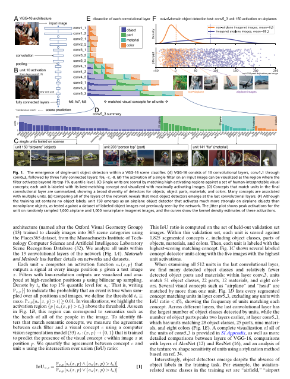
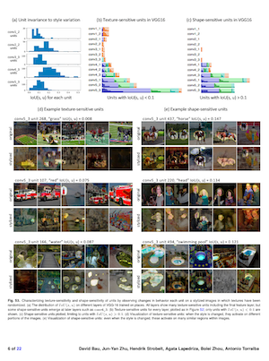
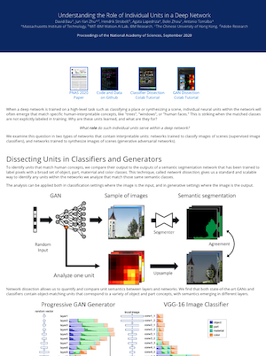

# What is the Role of a Neuron?

When a deep network is trained on a high-level task such as classifying a place or synthesizing a scene, individual neural units within the network will often emerge that match specific human-interpretable concepts, like "trees", "windows", or "human faces."

What role do such individual units serve within a deep network?

We examine this question in two types of networks that contain interpretable units: networks trained to classify images of scenes (supervised image classifiers), and networks trained to synthesize images of scenes (generative adversarial networks).

[**Understanding the Role of Individual Units in a Deep Network**](https://dissect.csail.mit.edu/).<br>
[David Bau](https://people.csail.mit.edu/davidbau/home/), [Jun-Yan Zhu](https://www.cs.cmu.edu/~junyanz/), [Hendrik Strobelt](http://hendrik.strobelt.com/), [Agata Lapedriza](https://www.media.mit.edu/people/agata/overview/), [Bolei Zhou](http://bzhou.ie.cuhk.edu.hk/), [Antonio Torralba](http://web.mit.edu/torralba/www/). <br>
Proceedings of the National Academy of Sciences, September 2020.<br>
MIT, MIT-IBM Watson AI Lab, IBM Research, The Chinese University of Hong Kong, Adobe Research

<table><tr>
<td><center><a href="https://doi.org/10.1073/pnas.1907375117"><br>PNAS Paper</a></center></td>
<td><center><a href="http://dissect.csail.mit.edu/paper/si.pdf"><br>Supplemental</a></center></td>
<td><center><a href="https://dissect.csail.mit.edu/" class="d-inline-block p-3 align-top"><br>Website</a></center></td>
<td><center><a href="https://arxiv.org/pdf/2009.05041.pdf" class="d-inline-block p-3 align-top"><br>arXiv</a></center></td>
</tr></table>


## Dissecting Units in Classifiers and Generators

Network dissection compares individual network units to the predictions of a semantic segmentation network that can label pixels with a broad set of object, part, material, and color classes. This technique gives us a standard and scalable way to identify any units within the networks that match those same semantic classes.

It works both in classification settings where the image is the input, and in generative settings where the image is the output.


We find that both state-of-the-art GANs and classifiers contain object-matching units that correspond to a variety of object and part concepts, with semantics emerging in different layers.


To investigate the role of such units within classifiers, we measure the impact on the accuracy of the network when we turn off units individually or in groups. We find that removing as few as 20 units can destroy the network's ability to detect a class, but retaining only those 20 units and removing 492 other units in the same layer can keep the network's accuracy on that same class mostly intact. Furthermore, we find that those units that are important for the largest number of output classes are also the emergent units that match human-interpretable concepts best.


In a generative network, we can understand the causal effects of neurons by observing changes to output images when sets of units are turned on and off. We find causal effects are strong enough to enable users to paint images out of object classes by activating neurons; we also find that some units reveal interactions between objects and specific contexts within a model.


## Citation

Bau, David, Jun-Yan Zhu, Hendrik Strobelt, Agata Lapedriza, Bolei Zhou, and Antonio Torralba. *Understanding the role of individual units in a deep neural network.* Proceedings of the National Academy of Sciences (2020).

## Bibtex

```
@article{bau2020role,
  author = {Bau, David and Zhu, Jun-Yan and Strobelt, Hendrik and Lapedriza, Agata and Zhou, Bolei and Torralba, Antonio},
  title = {Understanding the role of individual units in a deep neural network},
  elocation-id = {201907375},
  year = {2020},
  doi = {10.1073/pnas.1907375117},
  publisher = {National Academy of Sciences},
  issn = {0027-8424},
  URL = {https://www.pnas.org/content/early/2020/08/31/1907375117},
  journal = {Proceedings of the National Academy of Sciences}
}
```
